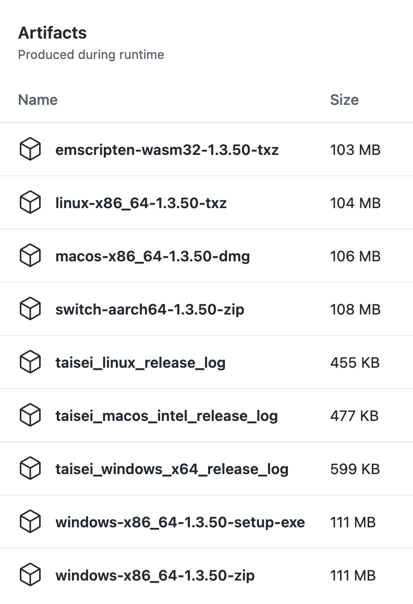

Taisei Project - Compiling FAQ
==============================

.. contents::

Introduction
------------

Currently, Taisei Project supports the following platforms:

  * Linux (x64)
  * Windows (x86/x64)
  * macOS (x64/ARM64)
  * Emscripten (WebGL/WASM32)
  * Switch Homebrew (ARM64)

While we tend to stick to `clang` as a compiler (for Windows, macOS, Emscripten, and Switch), each one requires its own unique toolchain to compile correctly for each platform. Setting up that toolchain for each release ends up being a challege, and it's likely that between releases, the toolchain has changed signifiicantly (especially in the case of Emscripten and macOS).

Taisei uses GitHub Actions and Docker to perform:

* automatic build tests
* reproduceable release builds
* automatic publishing of release tags
* nightly/weekly builds and deployments of our Emscripten port

The entire idea is to remove the guesswork in remembering how to build and release Taisei for each release, and to make it less painful to deploy simple bugfixes or improvements.

This is done in two ways:

* GitHub Actions to perform most of the basic automatic building tasks
* provider Dockerfiles so that toolchains aren't completely locked into GitHub Actions (and also build our own containers when necessary)

GitHub Actions
--------------

Pipeline Overview
"""""""""""""""""

Test Builds
'''''''''''

File: `.github/workflows/main.yml <.github/workflows/main.yml>`__

This file contains the test builds that run on every commit to make sure that the major supported platforms are buildable.

The order of operations for most builds are:

* Check out Taisei
* Install toolchains and libraries use for building Taisei
  * `meson` is installed through `pip` as it allows us to lock in a specific known-good version (currently `0.56.2`)
* Configure the project using `meson` and a `.ini` `machine file <https://mesonbuild.com/Machine-files.html>`__ file which contains all of the variables necessary to build Taisei for that platform
* Build Taisei, ensure it's installable into a temporary path
* Run a "headless" test with a one-frame Taisei replay file to ensure the program launches
* Upload the build log for inspection

With the exception of the macOS build (which requires XCode on macOS to build), all builds use `ubuntu` runners to compile Taisei.

NOTE: Pipeline builds can be skipped (for whatever reason) by appending `[skip ci]` to your commit message for a particular commit. This can be useful if you're stashing changes and know it won't build correctly.

Release Builds
''''''''''''''

File: `.github/workflows/release.yml <.github/workflows/release.yml>`__

Release builds are much like test builds, with a few key exceptions:

* More architectures are built for (namely, Windows 32-bit, and macOS ARM64)
* The resulting builds are archived into `.zip`, `.tar.xz`, `.dmg` packages
* The `.zip`'s, etc. are uploaded to GitHub's artifact cache, which can then be used in the publishing pipeline (more on this later)
* Logs are still uploaded for inspection

Publish Action
''''''''''''''

File: `.github/workflows/publish.yml <.github/workflows/publish.yml>`__

The Publish action is pretty basic, and most of the work had already been done by the Release Build action. What this does is:

* Download the GitHub artifact cache containing the `.zip`, `.dmg`, etc. files.
* Run `sha256sum` against the resulting packages to generate `.sha256sum` files so that downloaders can verify their binaries
* Generate signed signature `.sig` files for further verification
* Upload the archives, the `.sha256sum`'s, and the `.sig`s to the Releases page based on the tag that was built, with contents of the committed changelog used as the release notes (more on these later)

The end result should be a "complete" release with every major supported platform's build being uploaded to the release page on the appropriate tag.

Dockerfiles
-----------

`Dockerfile`s are provided in `misc/ci/Dockerfile.*` to provide an easy(-ish) way to build a toolchain in a repeatable way for building Taisei.

`Dockerfile.switch` - builds the toolchain necessary to compile for Switch Homebrew, currently used in CI to build that package

`Dockerfile.windows` - uses the `mingw-llvm` toolkit to compile the Windows package

`Dockerfile.linux` - compiles a Linux package using the standard toolkit

`Dockerfile.angle` - ugh... an extremely cursed Dockerfile that provides a "repeatable" way of building ANGLE. This was mostly an experiment to see what it would take to automate ANGLE building for Windows releases. In short, it's too much effort, but the work was done, so I've uploaded it for posterity. Keep in mind this requires a Windows 10 Pro (and it must be 'Pro') host running Docker in Windows Container Mode, and cannot be run on any other platform. I'm not even sure if Docker Hub would let us upload an image this heavy, so it's pretty much useless for using in a GitHub Action.

(There is no `Dockerfile.macos` because Apple hates freedom.)

Publishing
----------

Overview
""""""""

To publish Taisei, you first start by creating a new changelog in `master` with the list of changes you want to highlight. After that, create or update a staging branch following a particular naming convention (in Taisei, this is currently `v1.3.x`), and `push` it to GitHub.

The `release` pipeline will then kick off, building all the supported platforms, in the `Actions` tab on GitHub. Once the build is complete (usually takes ~10 minutes), you can click on that job in `Actions`, and it will show you a list of Artifacts to download:

Download whichever one you want to test, and confirm it works as you'd expect.

Then, you begin the `tag` process, which sets this branch's history in stone, so to speak. (You can _technically_ force-push a branch, but we don't want to do that, ever.)

After that, the `release` pipeline runs again. You can also download these artifacts and make sure they work the way you'd expect again, if you'd like.

Once complete, you then go to the `publish` action in the `Actions` tab, input the `tag` you want to publish. Then, it will begin the publish procedure, and in a few minutes the releases page of the project should update with the new tag and all the binaries/sha256sums/sigs. Yay!

Specifics
"""""""""

The optimal way to publish something is this. Assuming `v1.4.0` as an example:

* In `master`, create a changelog under `changelogs/changelog-v1.4.0.txt` with everything you want in it. Look at other changelogs for examples. `commit` and `push` this changelog.

* Create a release branch of some sort with the commits you want. Based on what's available in `release.yml`, you can use one of the following formats (substitute `1.4.0` for what you want):
  * `v1.4.0-rc`
  * `v1.4.0-beta`
  * `v1.4.0` (tag only, for official release)

In the case of Taisei, we also have the `v1.4.x` branch which is used for staging to tags. So in that case you'd:
* `git cherry-pick` the commits you want into `v1.4.x` (or `v1.4.x-beta`, etc), `push` the *branch* to GitHub
* Wait for release builds to finish, test them
* `tag` the `branch` with the version you'd like to put out, `push` to GitHub (i.e: `git tag v1.4.0 && git push origin v1.4.0`)
* Once release builds are finished/verified *again*, go to `Actions` -> `Publish`, input the tag (`v1.4.0`), and kick it off
* Release should be fully published! Yay!

