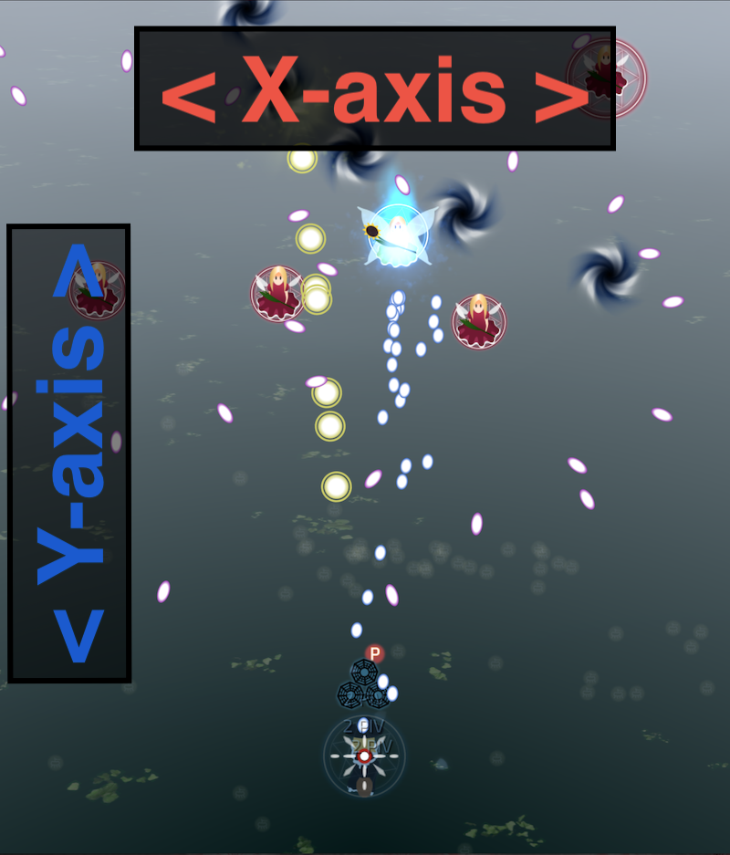
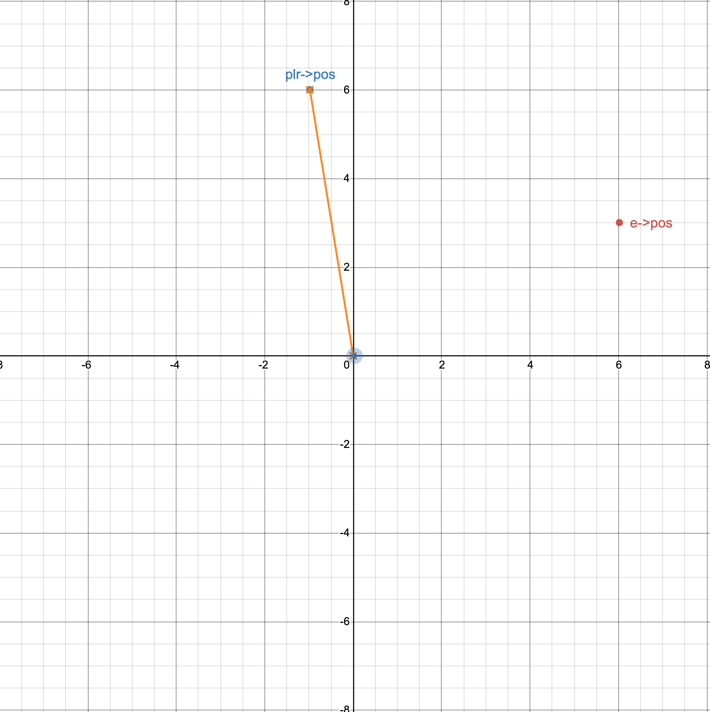
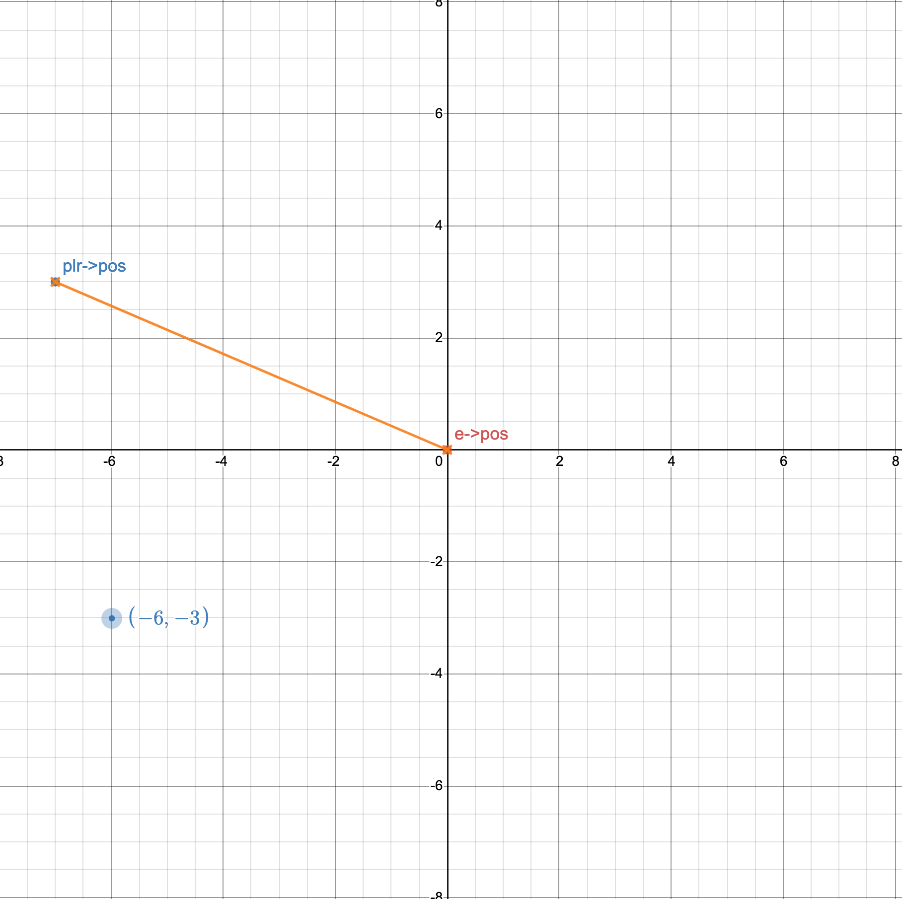

Complex Numbers in Taisei
=========================

.. contents::

Introduction
''''''''''''

Taisei uses `complex numbers <https://en.wikipedia.org/wiki/Complex_number>`__ in its game code for a number of
different functions, such as:

- Player and enemy position and movement
- Danmaku patterns and bullet movement
- Special effects and particles
- Spell card backgrounds for bosses

As you can probably see, it’s important to have a firm grasp of complex numbers in order to make heads or tails of what
the game is doing if you want to develop for it.

Complex numbers shouldn’t be scary. If you have a baseline of middle school mathematics, and certainly if you’re
familiar with the concept of “variables” in programming, it should only take you a couple of hours to get used to
thinking in these terms, and using them effectively in the code.

Additionally, the C programming language has a very robust support for handling complex numbers, whereas the support for
things like vectors and matrices isn’t as readily available or pleasant to use.

There are many different places you can learn about complex numbers, but we’ve found these two YouTube creators do a
better job than we could of explaining the core concepts behind complex numbers.

- `Imaginary Numbers are Real <https://www.youtube.com/watch?v=T647CGsuOVU&list=PLiaHhY2iBX9g6KIvZ_703G3KJXapKkNaF>`__
  by Welch Labs: short and punchy video series
- `Complex Number Fundamentals <https://www.youtube.com/watch?v=5PcpBw5Hbwo>`__ by 3Blue1Brown: a longer lecture-style
  format

More helpful links:

- `Formula for converting a *cartesian coordinate* to a *polar coordinate*
  <https://www.engineeringtoolbox.com/converting-cartesian-polar-coordinates-d_1347.html>`__

Core Concept
''''''''''''

One important fact about complex numbers is that one can think of the same complex number in two ways: either as a
traditional two-dimensional vector or as a length and an angle (measured starting from the positive X-axis). When adding
two complex numbers, they behave exactly like vectors.

But in contrast to vectors, one can also multiply them together and get a new complex number. In this multiplication,
their second interpretation becomes useful: multiplying two complex numbers means multiplying their lengths and adding
their angles.

In-Game Examples
''''''''''''''''

Coordinate System
^^^^^^^^^^^^^^^^^

Taisei’s gameplay takes place entirely on a 2D plane, using an “X” and “Y” coordinate system.

Complex numbers in Taisei represent the “X-axis” (or “real”) and “Y-axis” (or “imaginary”). This is not exactly a
widely-adopted way of thinking about it, but as mentioned in *Core Concept*, it allows us to perform operations on the
coordinate system that wouldn’t otherwise be possible using vectors. There are pros and cons to either way of doing it,
with complex numbers being more involved to use but providing a few worthwhile advantages.

Simple Movement
^^^^^^^^^^^^^^^

There are a few concrete examples within Taisei’s code, so let’s take a look at one: a piece of movement code for a
fairy.

.. code-block:: c

   enemy->move = move_towards(VIEWPORT_W/2.0 + 200.0 * I, 0.035);

The important piece here, for our purposes, is:

.. code-block:: c

   VIEWPORT_W/2.0 + 200.0 * I

What this is doing is specifying a position on the “real” X-axis (``VIEWPORT_W/2.0``, which in Taisei means ``480.0 /
2.0`` or ``240.0``), and then specifying a position on the “imaginary” Y-axis (``200.0 * I``). The ``I`` here is the
same ``i`` described in the videos and the above explanation.

So what we’re really looking at here is:

.. code-block:: c

   240.0 (real) + 200.0i (imaginary)

Or “move 240 units on the (real) X-axis, and then 200 units on the (imaginary) Y-axis.”

This is what’s called a **Cartesian Coordinate.** What the function ``move_towards`` then does is make the enemy
sprite/object move towards that point on the X/Y axis at a certain rate (defined by ``0.035``).

Simple Danmaku
^^^^^^^^^^^^^^

Let’s look at a danmaku pattern to see how complex numbers are used in-game.

.. code-block:: c

   cmplx aim = cnormalize(global.plr.pos - enemy->pos);

This ``aim`` variable could be passed to a ``move_towards`` function attached to a ``PROJECTILE`` object. The effect is
bullets shooting directly at the player in a straight line, wherever on the screen they may be at the time.

Let’s look at the argument inside ``cnormalize`` first, ``global.plr.pos - e->pos``. Both ``global.plr.pos`` and
``e->pos`` are *complex numbers*, in that they have both *real* and *imaginary* parts. Much like the example in *Simple
Movement*, they represent a place on the X/Y grid.

In the format of ``[X, Y]``, let’s say that ``global.plr.pos`` is ``[-1, 6]``, and that ``enemy->pos`` is ``[6, 3]``.

When you subtract ``[6, 3]`` (enemy position) from ``[-1, 6]`` (player position), you end up with ``[-7, 3]``, as seen
here with ``plr->pos``.

This also conveniently lets the enemy position ``enemy->pos`` become the new “origin,” or ``[0, 0]``. This is useful
because it means that we can more easily determine what angle the danmaku need to travel in to travel towards the
player.

As a vector, ``[-7, 3]`` points from the enemy position to the player position. Its length is the distance between enemy
and player. Its angle is the direction we want the danmaku to travel in. In this example, we don’t care about the
distance. We want a unit length pointer towards the player. ``cnormalize()`` does this for us by giving us a complex
number with the same angle as its argument but with a length of “1”.

Let’s consider how we might use this new ``aim`` variable later on, say in a ``PROJECTILE`` block for a danmaku bullet:

.. code-block:: c

   // aim directly at the player
   cmplx aim = cnormalize(global.plr.pos - enemy->pos);

   // a bit of randomization
   cmplx offset = cdir(M_PI/180 * rng_sreal());

   // later, inside a PROJECTILE() block...
   .move = move_asymptotic_simple(aim * offset, 5),

The important piece here is the ``aim * offset`` inside the ``move()`` block. Being able to multiply complex numbers by
each other means “procedurally” generating danmaku patterns becomes much easier. Multiplying two complex numbers
together like this means adding their angles, and in the case of something like ``cdir(M_PI/180 * rng_sreal())``, you
can quickly do rotations in your patterns without handling cumbersome matrices. In this case, we add some random
scattering to the original direction of “shoot directly at the player” contained in ``aim`` with an additional
``offset`` angle.

Hopefully, you can see now why complex numbers provides several advantages with the slight trade-off of being slightly
more esoteric in the context of game programming.
