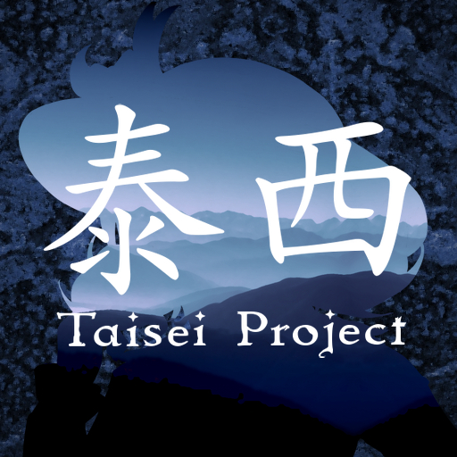

Taisei Switch Port
==================

<p align="center"></p>

## Installation

### Grabbing Binaries

Download the latest release,
and extract the archive in the `/switch` folder on your SD Card. 
Then, run the game from the [hbmenu](https://github.com/switchbrew/nx-hbmenu)
using [hbl](https://github.com/switchbrew/nx-hbloader).

**WARNING:** This will crash if executed from an applet such as the Photo/Library applet,
be sure to launch it from hbmenu on top of the game of your choice,
which can be done by holding R over any installed title on latest Atmosphère, with default settings.

### Build dependencies

For building, you need the devkitA64 from devkitPro setup, along with switch portlibs and libnx. 
Documentation to setup that can be found [here](https://switchbrew.org/wiki/Setting_up_Development_Environment).

You will need the following packages/group installed from devkitPro pacman: 
`switch-dev switch-portlibs dkp-toolchain-vars switch-pkg-config`

Other dependencies common to the main targets include:

    * meson >= 1.8.0
    * Python >= 3.14 (or with zstd api backported)
    * ninja
    * gettext

### Compiling from source

Run one of the following commands from the project root:

```
mkdir -p ./build/nx
./switch/crossfile.sh > ./build/nx/crossfile.ini
meson setup --cross-file="./build/nx/crossfile.ini" . ./build/nx
ninja -C ./build/nx
```

**Note:** You can optionally set a custom prefix and `ninja install` NRO and assets into that folder.